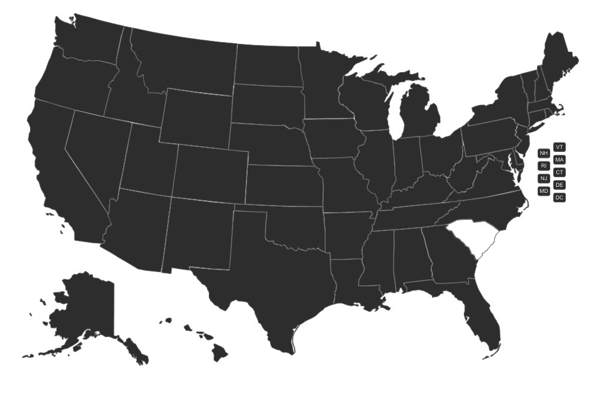
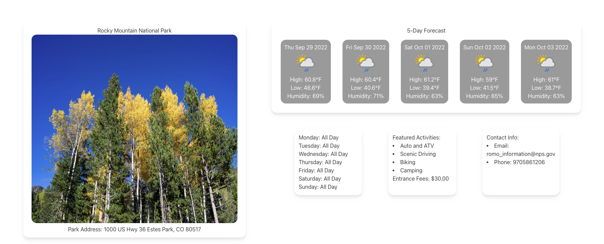

# National Park Finder
 https://rarellano5280.github.io/National-Park-Finder/

## Description
We created a webpage that allows a user to click on an interactive map in order to display the state's most popular national park. Our webpage also displays a five-day forecast so that they can prepare for the adventure they will soon embark on. In addition, our webpage will display a few other details about the park such as hours of operation, activites to do, cost and a picture of the park. 

# Usage 
* When the user views the top of the page they will see our header with links to additional resources and a contributors page.

* The user can then navigate down and they will be presented with a map of the United States. 

* If the user hovers over the map they will find that this map is interactive and clickable.
* When the user clicks on the map they will be presented with a famous national park from that selected state, they will also be presented with park information and a 5 day forecast for the area.

* The name of the park they selected will be saved to local storage. 
* The user can click on a different state to overide their current selection. 

# Authors
* Robert Arellano
* Madisen Vogel
* Antonio Duran
* Eugene isingizwe

## License
MIT License

Copyright (c) 2022 Robert
